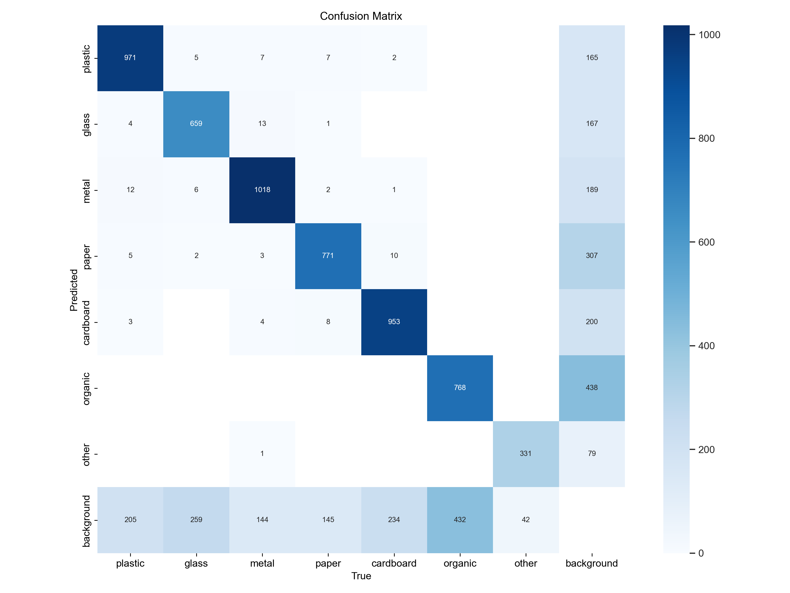
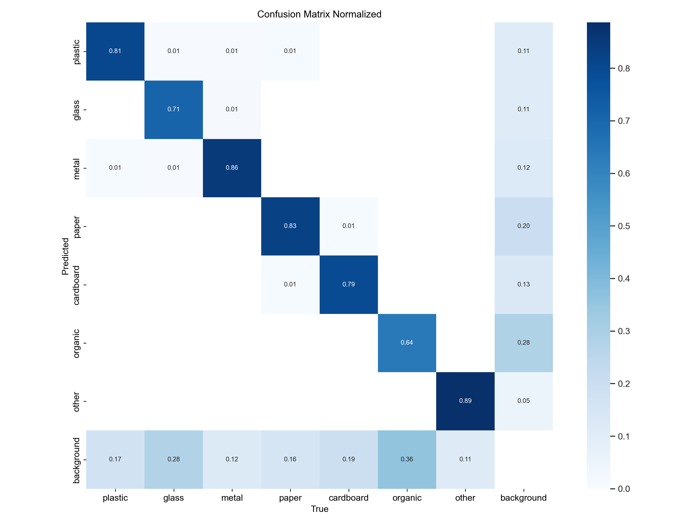
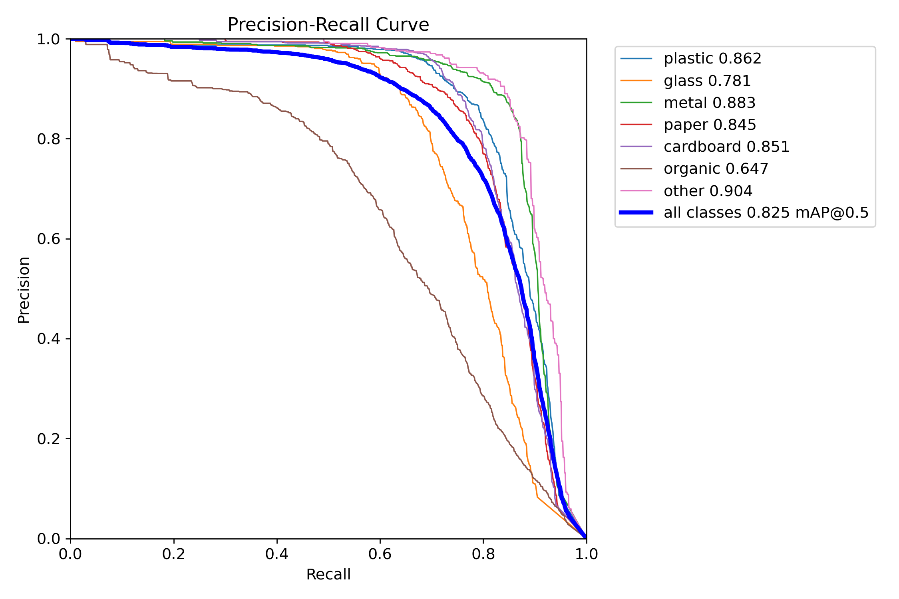
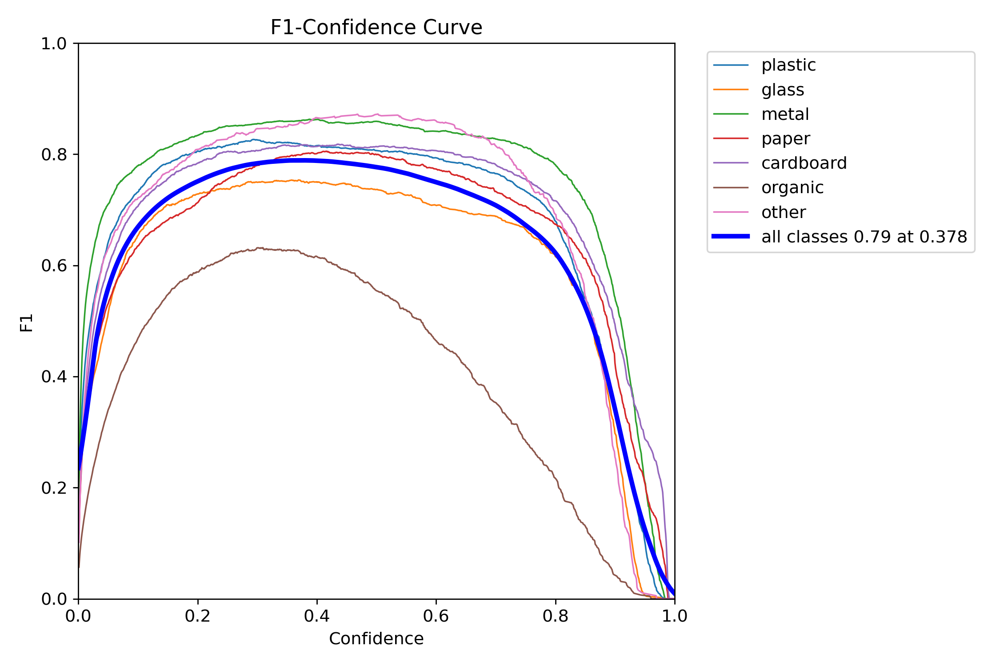
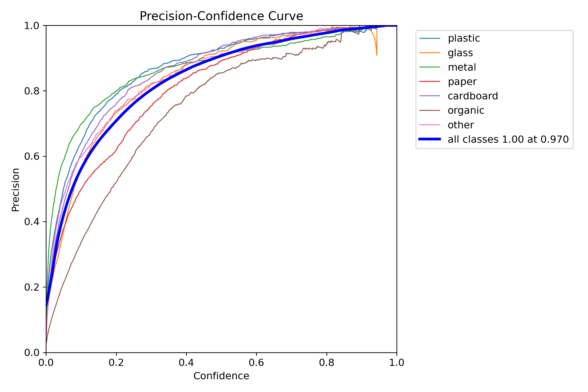
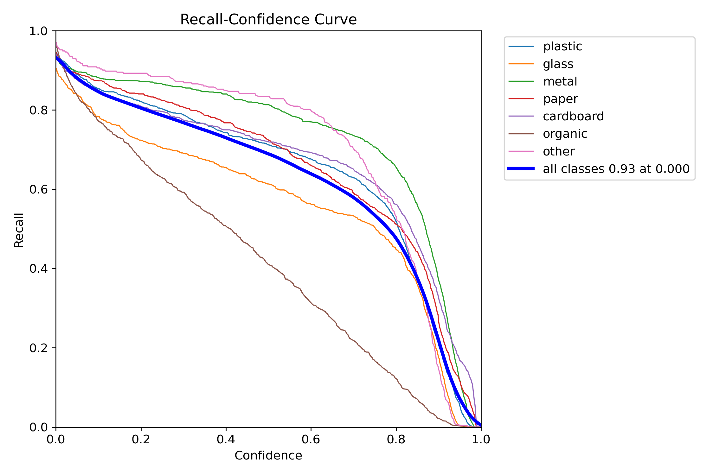

# YOLOv8n Waste Sorting — Quality Report

- **Weights:** `runs\dl\trash_yolov8n_tuned_v1\weights\best.pt`
- **Dataset:** `tuned_dataset_v1\data.yaml`
- **Image size:** 640

## Overall — `val` split

| Metric | Value |
|---|---|
| Precision | 0.8508 |
| Recall | 0.7403 |
| mAP@0.5 | 0.8247 |
| mAP@0.5:0.95 | 0.6243 |
| Fitness | 0.6443 |

### Per-class

| Class | P | R | F1 | AP@0.5 | AP@0.5:0.95 |
|---|---|---|---|---|---|
| metal | 0.8785 | 0.8445 | 0.8612 | 0.8835 | 0.7427 |
| cardboard | 0.8844 | 0.7586 | 0.8167 | 0.8508 | 0.6988 |
| paper | 0.8208 | 0.7795 | 0.7996 | 0.8445 | 0.6654 |
| plastic | 0.8931 | 0.7520 | 0.8165 | 0.8623 | 0.6596 |
| other | 0.8576 | 0.8559 | 0.8568 | 0.9039 | 0.6580 |
| glass | 0.8627 | 0.6649 | 0.7510 | 0.7808 | 0.5716 |
| organic | 0.7585 | 0.5267 | 0.6217 | 0.6469 | 0.3739 |

**Speed (ms/image):** preprocess `0.91` · inference `2.40` · postprocess `0.67`

## Overall — `test` split

| Metric | Value |
|---|---|
| Precision | 0.8458 |
| Recall | 0.7259 |
| mAP@0.5 | 0.8102 |
| mAP@0.5:0.95 | 0.6216 |
| Fitness | 0.6405 |

### Per-class

| Class | P | R | F1 | AP@0.5 | AP@0.5:0.95 |
|---|---|---|---|---|---|
| plastic | 0.8754 | 0.8433 | 0.8591 | 0.8959 | 0.7188 |
| metal | 0.8752 | 0.7750 | 0.8220 | 0.8316 | 0.6897 |
| cardboard | 0.8770 | 0.7158 | 0.7883 | 0.8072 | 0.6579 |
| glass | 0.8846 | 0.7374 | 0.8043 | 0.8449 | 0.6574 |
| paper | 0.8352 | 0.7230 | 0.7750 | 0.8084 | 0.6537 |
| other | 0.8490 | 0.8248 | 0.8367 | 0.8846 | 0.6289 |
| organic | 0.7244 | 0.4622 | 0.5643 | 0.5985 | 0.3447 |

**Speed (ms/image):** preprocess `0.91` · inference `2.41` · postprocess `0.63`

## Plots

### Confusion matrix

### Confusion matrix (normalized)

### Precision-Recall curve

### F1 vs. confidence

### Precision vs. confidence

### Recall vs. confidence

## Sample predictions

See the `predictions/` folder for annotated images.

## Interpretation hints

- If `mAP@0.5:0.95` < 0.4 on test: consider more epochs, `imgsz=800`, or class balancing.
- If a single class has very low AP: check dataset balance and label quality for it.
- If recall is much lower than precision: lower inference `conf` threshold in the app, or add more training data for hard-to-detect classes.
- If the confusion matrix shows `plastic ↔ glass` bleed: these look alike in photos; consider a second-stage classifier or adding contextual cues.
