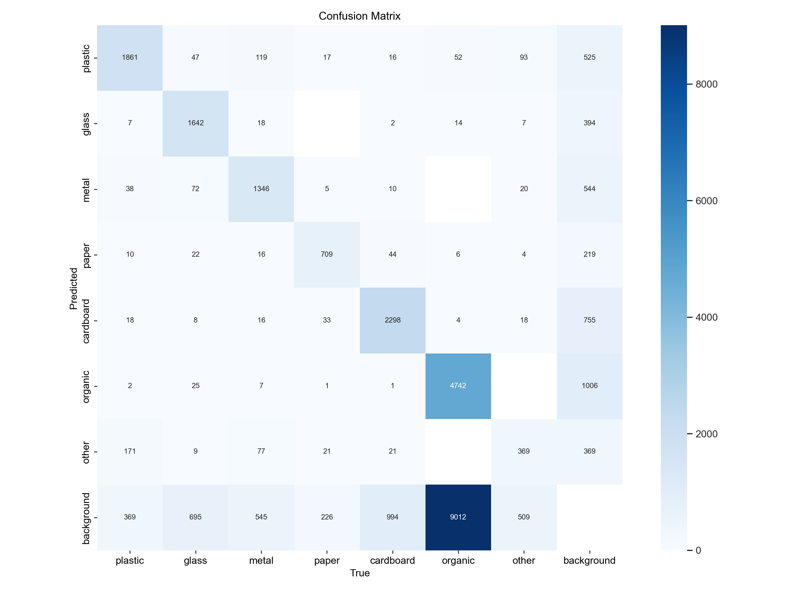
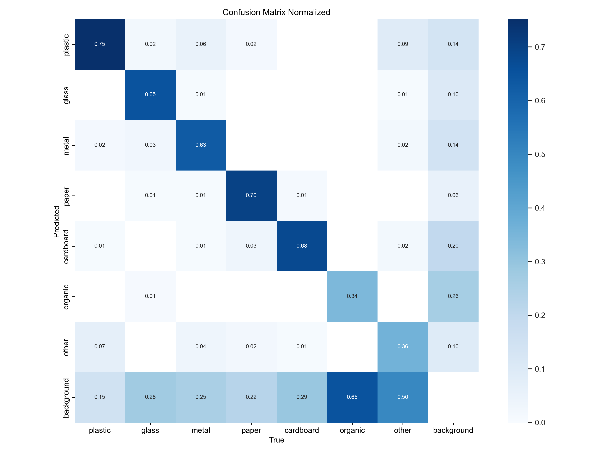
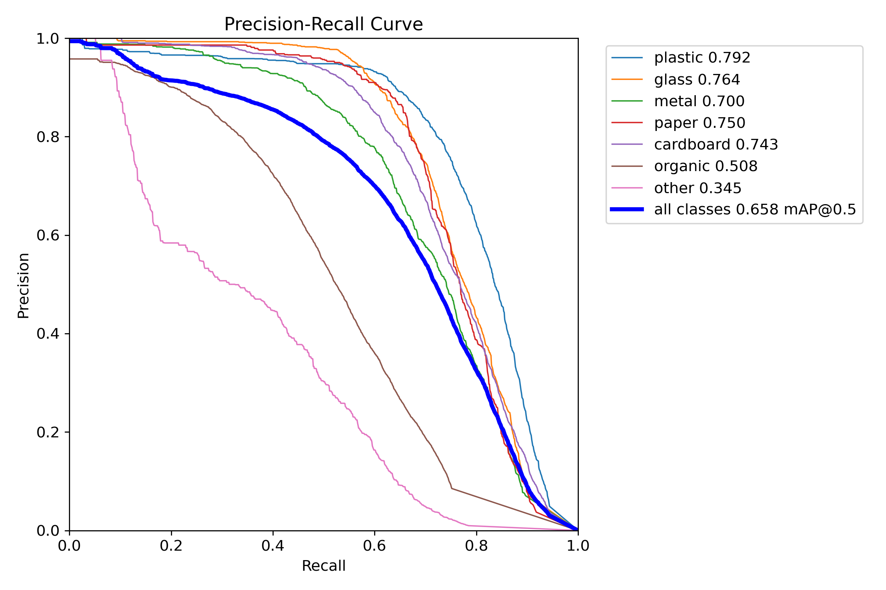
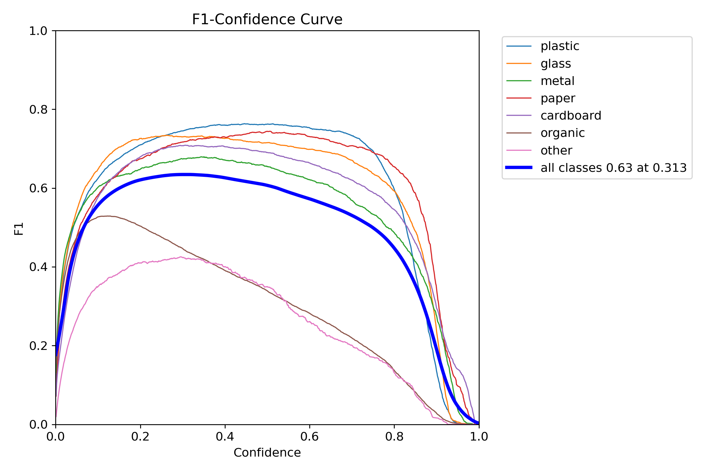
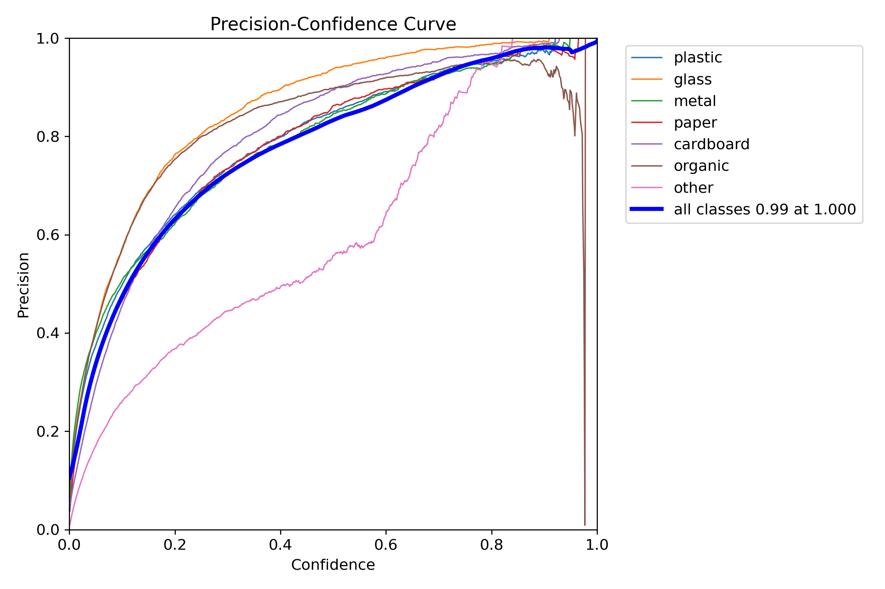
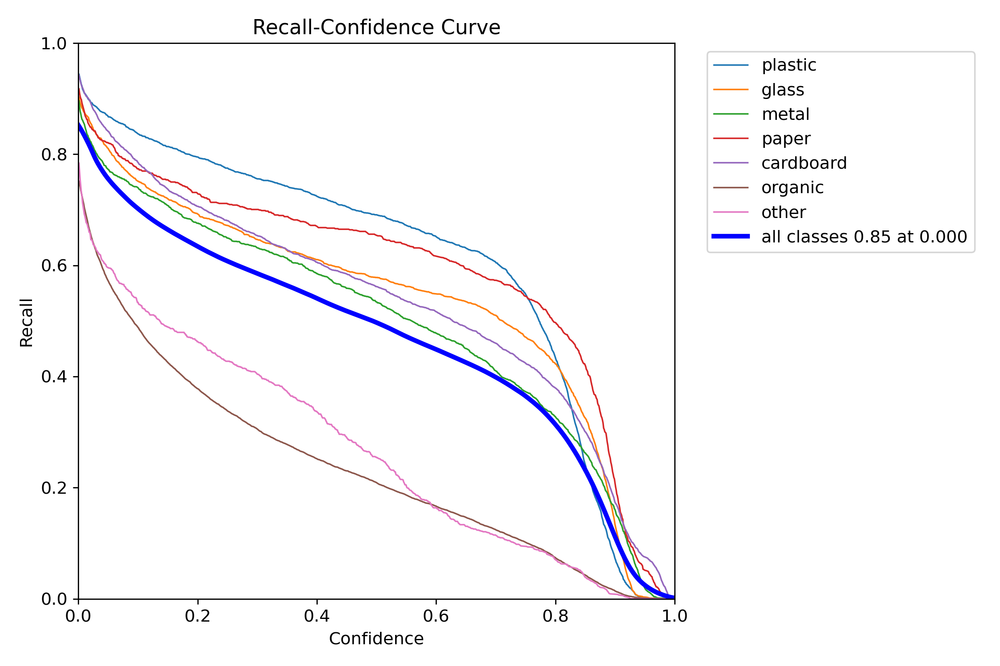

# YOLOv8n Waste Sorting — Quality Report

- **Weights:** `C:\FYP_v2\runs\trash_yolov8n_v2\weights\best.pt`
- **Dataset:** `C:\FYP_v2\merged_dataset_v2\data.yaml`
- **Image size:** 640

## Overall — `val` split

| Metric | Value |
|---|---|
| Precision | 0.7271 |
| Recall | 0.5841 |
| mAP@0.5 | 0.6575 |
| mAP@0.5:0.95 | 0.4821 |
| Fitness | 0.4996 |

### Per-class

| Class | P | R | F1 | AP@0.5 | AP@0.5:0.95 |
|---|---|---|---|---|---|
| plastic | 0.7369 | 0.7557 | 0.7461 | 0.7923 | 0.5934 |
| paper | 0.7364 | 0.6996 | 0.7175 | 0.7496 | 0.5883 |
| cardboard | 0.7740 | 0.6527 | 0.7082 | 0.7432 | 0.5734 |
| glass | 0.8412 | 0.6456 | 0.7306 | 0.7644 | 0.5576 |
| metal | 0.7254 | 0.6301 | 0.6744 | 0.7003 | 0.5217 |
| organic | 0.8300 | 0.3026 | 0.4435 | 0.5076 | 0.2884 |
| other | 0.4456 | 0.4026 | 0.4230 | 0.3452 | 0.2517 |

**Speed (ms/image):** preprocess `0.86` · inference `63.70` · postprocess `1.10`

## Overall — `test` split

| Metric | Value |
|---|---|
| Precision | 0.6321 |
| Recall | 0.5370 |
| mAP@0.5 | 0.5698 |
| mAP@0.5:0.95 | 0.4271 |
| Fitness | 0.4413 |

### Per-class

| Class | P | R | F1 | AP@0.5 | AP@0.5:0.95 |
|---|---|---|---|---|---|
| cardboard | 0.6876 | 0.7376 | 0.7117 | 0.7861 | 0.6216 |
| metal | 0.7689 | 0.7282 | 0.7480 | 0.7376 | 0.6167 |
| plastic | 0.7157 | 0.6346 | 0.6727 | 0.7055 | 0.4981 |
| paper | 0.7002 | 0.5647 | 0.6252 | 0.6279 | 0.4762 |
| other | 0.7200 | 0.3734 | 0.4918 | 0.4471 | 0.2939 |
| organic | 0.2002 | 0.1837 | 0.1916 | 0.1143 | 0.0560 |

**Speed (ms/image):** preprocess `0.81` · inference `61.86` · postprocess `0.76`

## Plots

### Confusion matrix

### Confusion matrix (normalized)

### Precision-Recall curve

### F1 vs. confidence

### Precision vs. confidence

### Recall vs. confidence

## Sample predictions

See the `predictions/` folder for annotated images.

## Interpretation hints

- If `mAP@0.5:0.95` < 0.4 on test: consider more epochs, `imgsz=800`, or class balancing.
- If a single class has very low AP: check dataset balance and label quality for it.
- If recall is much lower than precision: lower inference `conf` threshold in the app, or add more training data for hard-to-detect classes.
- If the confusion matrix shows `plastic ↔ glass` bleed: these look alike in photos; consider a second-stage classifier or adding contextual cues.
