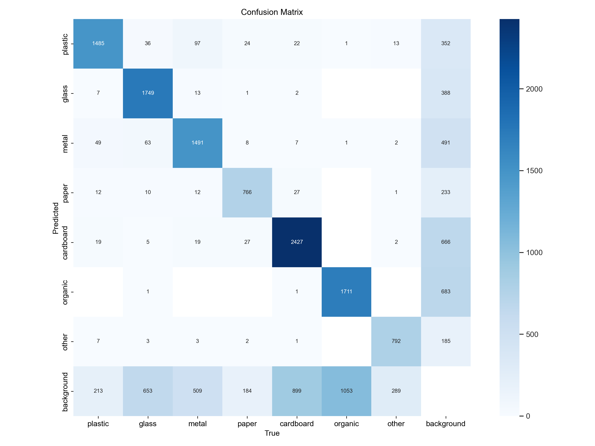
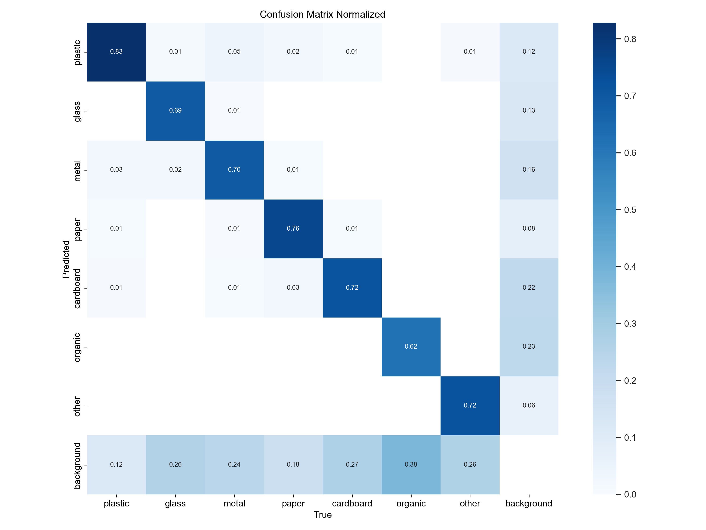
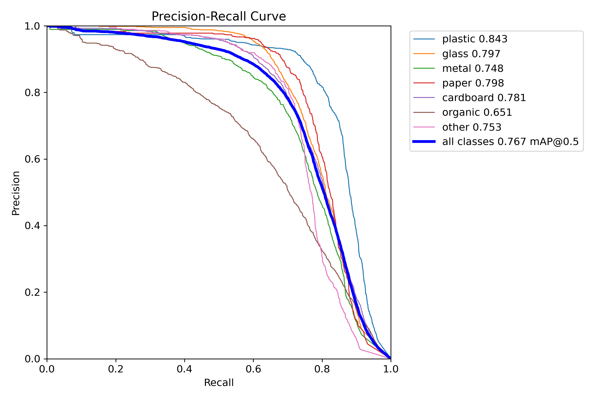
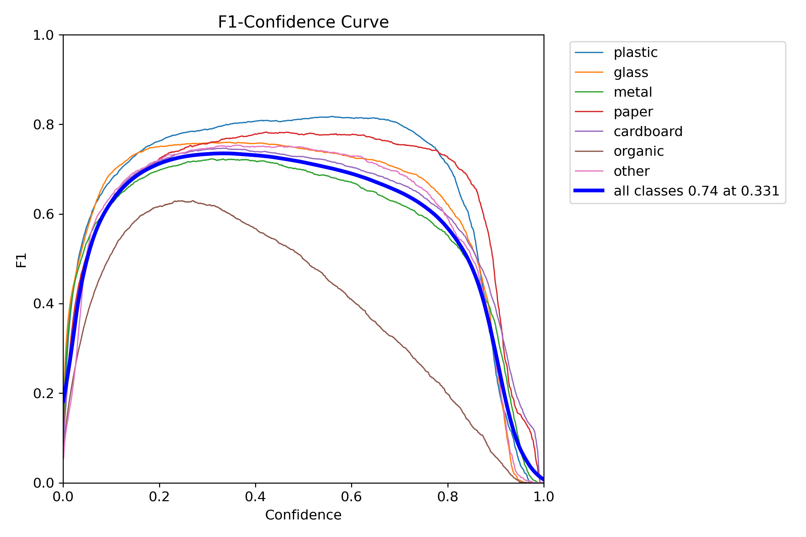
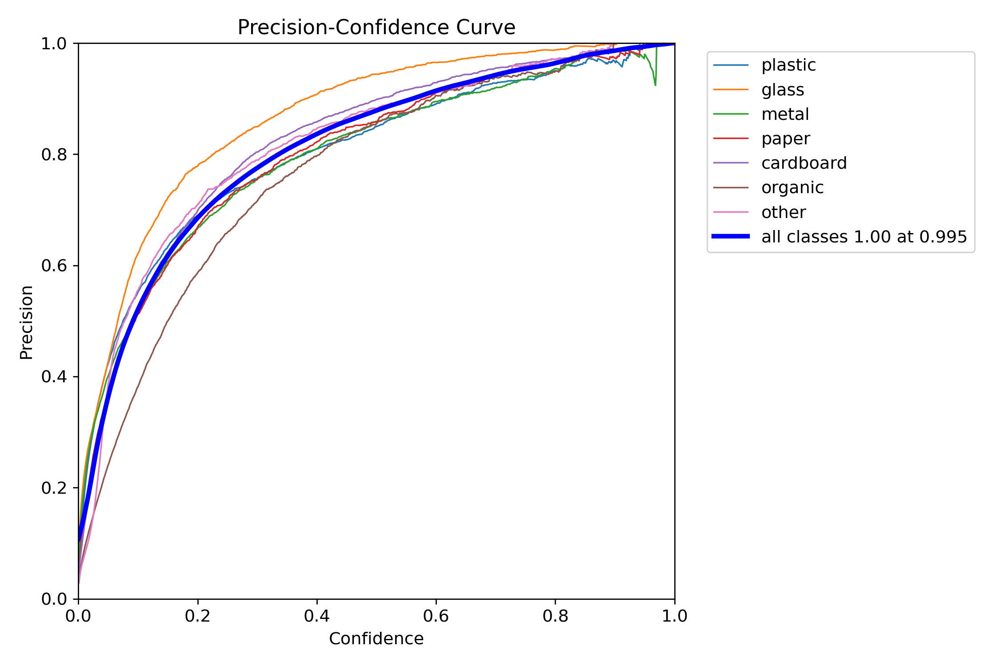
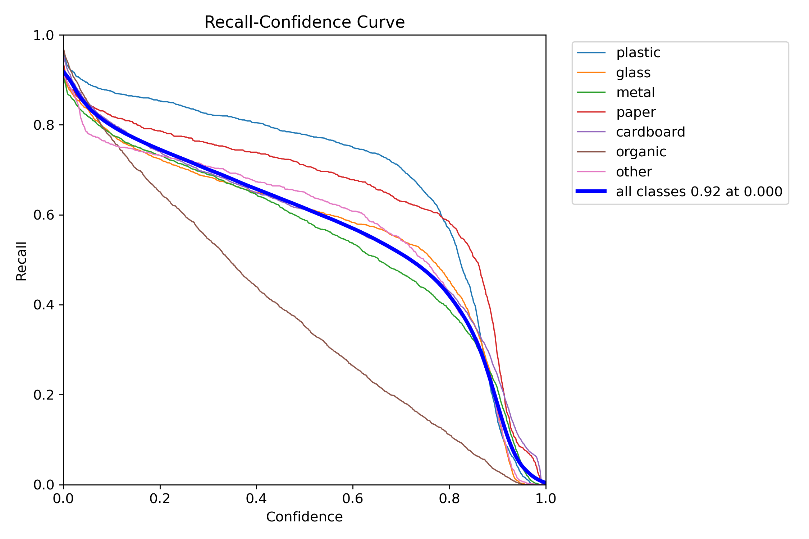

# YOLOv8n Waste Sorting — Quality Report

- **Weights:** `C:\FYP_v2\runs\trash_yolov8n_v3\weights\best.pt`
- **Dataset:** `C:\FYP_v2\merged_dataset_v3\data.yaml`
- **Image size:** 640

## Overall — `val` split

| Metric | Value |
|---|---|
| Precision | 0.7994 |
| Recall | 0.6869 |
| mAP@0.5 | 0.7672 |
| mAP@0.5:0.95 | 0.5784 |
| Fitness | 0.5973 |

### Per-class

| Class | P | R | F1 | AP@0.5 | AP@0.5:0.95 |
|---|---|---|---|---|---|
| plastic | 0.7769 | 0.8198 | 0.7977 | 0.8429 | 0.6578 |
| paper | 0.7836 | 0.7516 | 0.7673 | 0.7980 | 0.6392 |
| cardboard | 0.8270 | 0.6805 | 0.7466 | 0.7810 | 0.6175 |
| glass | 0.8714 | 0.6730 | 0.7594 | 0.7969 | 0.5966 |
| other | 0.8117 | 0.6997 | 0.7516 | 0.7526 | 0.5765 |
| metal | 0.7775 | 0.6733 | 0.7217 | 0.7480 | 0.5703 |
| organic | 0.7479 | 0.5105 | 0.6068 | 0.6510 | 0.3909 |

**Speed (ms/image):** preprocess `1.25` · inference `8.36` · postprocess `2.40`

## Overall — `test` split

| Metric | Value |
|---|---|
| Precision | 0.7939 |
| Recall | 0.6752 |
| mAP@0.5 | 0.7559 |
| mAP@0.5:0.95 | 0.5754 |
| Fitness | 0.5935 |

### Per-class

| Class | P | R | F1 | AP@0.5 | AP@0.5:0.95 |
|---|---|---|---|---|---|
| glass | 0.6826 | 0.8719 | 0.7657 | 0.8630 | 0.7142 |
| cardboard | 0.7801 | 0.7390 | 0.7590 | 0.8066 | 0.6514 |
| metal | 0.8214 | 0.7364 | 0.7766 | 0.7678 | 0.6457 |
| other | 0.8914 | 0.6820 | 0.7727 | 0.7947 | 0.5766 |
| plastic | 0.8390 | 0.6152 | 0.7099 | 0.7451 | 0.5365 |
| paper | 0.7971 | 0.5636 | 0.6603 | 0.6614 | 0.5153 |
| organic | 0.7460 | 0.5184 | 0.6117 | 0.6528 | 0.3882 |

**Speed (ms/image):** preprocess `1.24` · inference `8.41` · postprocess `2.65`

## Plots

### Confusion matrix

### Confusion matrix (normalized)

### Precision-Recall curve

### F1 vs. confidence

### Precision vs. confidence

### Recall vs. confidence

## Sample predictions

See the `predictions/` folder for annotated images.

## Interpretation hints

- If `mAP@0.5:0.95` < 0.4 on test: consider more epochs, `imgsz=800`, or class balancing.
- If a single class has very low AP: check dataset balance and label quality for it.
- If recall is much lower than precision: lower inference `conf` threshold in the app, or add more training data for hard-to-detect classes.
- If the confusion matrix shows `plastic ↔ glass` bleed: these look alike in photos; consider a second-stage classifier or adding contextual cues.
